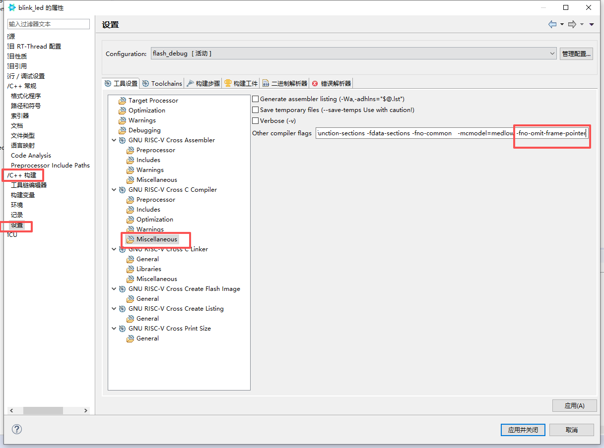
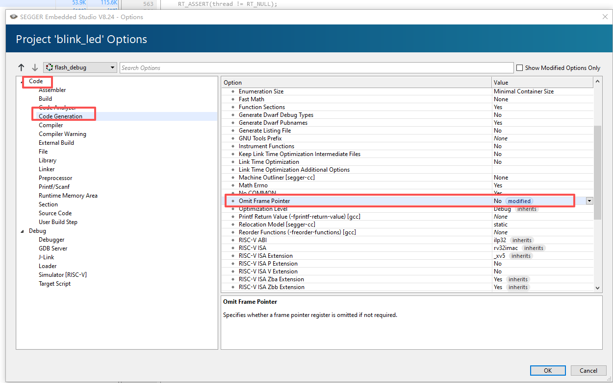

# RISC-V 栈回溯机制实现原理详解

本文档详细解释 `hpm_rtt_hw_util.c` 中实现的 RISC-V 架构栈回溯功能。


## 目录

- [1. 快速上手指南](#1-快速上手指南)
- [2. RISC-V 调用约定与栈帧结构基础](#2-risc-v-调用约定与栈帧结构基础)
- [3. rt_hw_backtrace_frame_get() - 获取线程的最内层栈帧](#3-rt_hw_backtrace_frame_get---获取线程的最内层栈帧)
- [4. rt_hw_backtrace_frame_unwind() - 栈帧展开](#4-rt_hw_backtrace_frame_unwind---栈帧展开)
- [5. rt_backtrace() - 打印当前执行点的完整调用栈](#5-rt_backtrace---打印当前执行点的完整调用栈)
- [6. 协作流程完整示例](#6-协作流程完整示例)
- [7. 总结](#7-总结)
- [8. 参考资料](#8-参考资料)

---

## 1. 快速上手指南

本节介绍如何在不同开发环境中启用和使用栈回溯功能。

### 1.1 在 RT-Thread Studio IDE 中开启功能

> ⚠️ **重要提示**：栈回溯功能依赖帧指针（Frame Pointer），必须确保编译器保留帧指针。

对于 RT-Thread Studio IDE 生成的工程，需要手动调整编译选项：

1. 打开项目属性：`项目` → `属性`
2. 导航至 `C/C++ Build` → `Settings` → `Miscellaneous`
3. 在 `Other compiler flags` 中添加 `-fno-omit-frame-pointer` 标志



**启用 MSH 命令行下的 backtrace 功能：**

1. 打开项目的 `RT-Thread Settings` 配置界面
2. 依次进入 `硬件` → `HPMicro RT-Thread backtrace configuration (experimental)`
3. 勾选 `Enable RT-Thread Backtrace for HPMicro BSP`

**启用异常处理中的 backtrace 功能：**

1. 在同一配置路径下，勾选 `Use RT-Thread Backtrace in Exception Handler`
2. 此时 `Enable RT-Thread Backtrace for HPMicro BSP` 会自动开启

### 1.2 在 ENV 环境中开启功能

对于使用 ENV 命令行工具的开发者，请按以下步骤操作：

1. 在项目根目录打开终端，运行 `menuconfig` 命令
2. 依次进入 `Hardware Drivers Config` → `HPMicro RT-Thread backtrace configuration (experimental)`
3. 选择所需的功能选项：
   - `Enable RT-Thread Backtrace for HPMicro BSP`：启用 MSH 命令行回溯
   - `Use RT-Thread Backtrace in Exception Handler`：启用异常处理中的回溯（自动开启上述选项）

### 1.3 SEGGER Embedded Studio 使用注意事项

> ⚠️ **重要提示**：栈回溯功能依赖帧指针（Frame Pointer），必须确保编译器保留帧指针。

对于 SEGGER Embedded Studio 生成的工程，需要手动调整编译选项：

1. 打开项目设置：`Project` → `Options`
2. 导航至 `Code` → `Code Generation`
3. 将 `Omit Frame Pointer` 设置为 **No**



### 1.4 MSH 命令行追溯线程栈

栈回溯功能提供了强大的运行时调试能力，可以查看任意线程的调用栈。

**步骤 1：查看当前所有线程**

使用 `list thread` 命令获取线程列表：

```
msh >list thread
thread           pri  status      sp     stack size max used left tick   error  tcb addr   usage
---------------- ---  ------- ---------- ----------  ------  ---------- ------- ---------- -----
led_th             1  suspend 0x000000d0 0x00000400    20%   0x0000000a EINTRPT 0x01204100  N/A
tshell            20  running 0x00000110 0x00001000    11%   0x00000004 OK      0x01202fc0  N/A
tidle0            31  ready   0x000000d0 0x00000400    21%   0x00000009 OK      0x01201860  N/A
timer              4  suspend 0x000000f0 0x00000200    46%   0x00000009 EINTRPT 0x01201f2c  N/A
```

**步骤 2：追溯指定线程的调用栈**

使用 `backtrace <tcb_addr>` 命令，其中 `<tcb_addr>` 是线程控制块地址（即上表中的 `tcb addr` 列）：

```
msh >backtrace 0x01204100
backtrace led_th(0x1204100), from 0x01204100
please use: addr2line -e rtthread.elf -a -f
 0x1ece 0x8000a658 0x80003d92
```

**步骤 3：使用 addr2line 解析符号**

将回溯地址转换为可读的函数名和源码位置：

```bash
$ riscv32-unknown-elf-addr2line.exe -e rtthread.elf -a -f 0x1ece 0x8000a658 0x80003d92

0x00001ece
led_thread_entry
D:/projects/hpm6e00evk/blink_led/applications/main.c:25
0x8000a658
rt_sem_take
...
0x80003d92
rt_thread_startup
...
```

### 1.5 异常发生时的自动回溯

当系统发生异常（如非法内存访问、未对齐访问等）时，异常处理程序会自动打印寄存器快照和调用栈回溯信息。

**异常输出示例：**

```
msh >
 \ | /
- RT -     Thread Operating System
 / | \     5.2.2 build Jan 19 2026 15:47:02
 2006 - 2024 Copyright by RT-Thread team
msh >
=== Testing Backtrace Feature ===
Attempting to access invalid memory address...

Stack frame:
----------------------------------------
ra      : 0x800074f2
mstatus : 0x00001880
t0      : 0x8000d448
t1      : 0x00003c10
t2      : 0xdeadbeef
a0      : 0x8000d478
a1      : 0xdeadbeef
a2      : 0x0000057d
a3      : 0x0000057d
a4      : 0x00000040
a5      : 0x00000020
a6      : 0xdeadbeef
a7      : 0x00000012
t3      : 0xdeadbeef
t4      : 0xdeadbeef
t5      : 0xdeadbeef
t6      : 0xdeadbeef

exception: store amo access fault happened, epc=80007502
mdcause: Misaligned access
cause=0x00000007, epc=0x80007502, ra=0x800074f2

please use: addr2line -e rtthread.elf -a -f
 0x80007502 0x800074f2
```

**关键信息解读：**

| 字段 | 含义 |
|------|------|
| `epc` | 异常发生时的程序计数器（PC），指向出错的指令地址 |
| `ra` | 返回地址寄存器，指向调用当前函数的位置 |
| `cause` | 异常原因码（0x7 = Store/AMO Access Fault） |
| `mdcause` | 更详细的异常原因（如 Misaligned access） |

使用 `addr2line` 工具可以将 `epc` 和回溯地址转换为源码位置，快速定位问题根因。

---

## 2. RISC-V 调用约定与栈帧结构基础

### 2.1 栈帧布局

在 RISC-V 架构中，每个函数调用都会创建一个栈帧，栈帧的标准布局如下：

```
高地址
+------------------+
| 返回地址 (ra)    |  <- fp - 1 * WORD
+------------------+
| 前一个帧指针     |  <- fp - 2 * WORD
+------------------+
| 局部变量         |
| ...              |
+------------------+  <- 当前 fp (s0/x8 寄存器指向这里)
| 保存的寄存器     |
+------------------+
| ...              |  <- sp (栈指针)
低地址
```

### 2.2 关键寄存器

- **fp (s0/x8)**：帧指针，指向当前函数的栈帧基址
- **ra (x1)**：返回地址寄存器，保存调用者的下一条指令地址
- **sp (x2)**：栈指针，指向当前栈顶

### 2.3 函数调用过程

每个函数入口会执行标准的 prologue 代码：

```assembly
addi sp, sp, -framesize   # 分配栈空间
sw   ra, offset(sp)        # 保存返回地址
sw   s0, offset(sp)        # 保存旧帧指针
addi s0, sp, framesize     # 设置新帧指针
```

函数退出时执行 epilogue 代码：

```assembly
lw   ra, offset(sp)        # 恢复返回地址
lw   s0, offset(sp)        # 恢复旧帧指针
addi sp, sp, framesize     # 释放栈空间
ret                         # 返回
```

这样形成了一个**单向链表**：每个帧指针都指向上一级调用者的栈帧。

---

## 3. rt_hw_backtrace_frame_get() - 获取线程的最内层栈帧

### 3.1 功能

从指定线程的保存上下文中提取"最内层"（当前执行点）的栈帧信息，即该线程被切换出去时的 PC 和 FP。

### 3.2 实现原理

```c
rt_err_t rt_hw_backtrace_frame_get(rt_thread_t thread, struct rt_hw_backtrace_frame *frame)
{
    rt_err_t rc;

    if (!thread || !frame)
    {
        rc = -RT_EINVAL;
    }
    else
    {
        /* 从线程被切换时保存的栈指针获取保存的上下文。
         * thread->sp 指向保存的寄存器上下文数组。
         * 对于 RISC-V，寄存器按 context_gcc.S 中定义的固定顺序保存
         */
        rt_ubase_t *psp = (rt_ubase_t *)thread->sp;
        
        /* 从保存的上下文中提取返回地址
         * RT_HW_SWITCH_CONTEXT_RA 是 ra (x1) 保存的索引位置
         */
        frame->pc = psp[RT_HW_SWITCH_CONTEXT_RA];
        
        /* 从保存的上下文中提取帧指针
         * RT_HW_SWITCH_CONTEXT_S0 是 s0 (x8/fp) 保存的索引位置
         */
        frame->fp = psp[RT_HW_SWITCH_CONTEXT_S0];
        
        rc = RT_EOK;
    }
    return rc;
}
```

### 3.3 线程上下文保存结构

当线程被切换时，其寄存器按如下顺序保存：

```
thread->sp -> +------------------+  <- psp 指向这里
              | ra (x1)          |  psp[0]  <- 返回地址
              | t0 (x5)          |  psp[1]
              | t1 (x6)          |  psp[2]
              | ...              |
              | s0 (x8)          |  psp[8]  <- 帧指针
              | s1 (x9)          |  psp[9]
              | ...              |
              +------------------+
```

### 3.4 为什么 PC = ra？

- 当线程被 `rt_hw_context_switch()` 切换出去时，CPU 会跳转到调度器代码
- 切换前会执行 `sw ra, 0(sp)` 保存返回地址
- 这个 ra 就是"调用上下文切换函数的下一条指令"，即线程恢复后的执行点
- 所以 `psp[0]` (保存的 ra) 就是该线程的当前 PC

### 3.5 实战示例

假设线程 A 的调用链是：

```
main()
  └─> thread_entry()
        └─> rt_sem_take()
              └─> [被切换]
```

被切换时：
- `thread->sp` 指向保存的上下文区域
- `psp[0]` (ra) = `rt_sem_take()` 的下一条指令地址（即返回到 `thread_entry()` 的位置）
- `psp[8]` (s0) = `rt_sem_take()` 函数的栈帧基址

调用 `rt_hw_backtrace_frame_get(thread_A, &frame)` 后：
- `frame.pc` = `rt_sem_take()` 返回地址（实际是 `thread_entry()` 中的某个地址）
- `frame.fp` = `rt_sem_take()` 的栈帧指针

---

## 4. rt_hw_backtrace_frame_unwind() - 栈帧展开

### 4.1 功能

给定当前栈帧，找到它的**调用者栈帧**（上一级函数），实现调用链的向上追溯。

### 4.2 核心实现

```c
rt_err_t rt_hw_backtrace_frame_unwind(rt_thread_t thread, struct rt_hw_backtrace_frame *frame)
{
    rt_err_t rc = -RT_ERROR;
    rt_ubase_t *fp = (rt_ubase_t *)frame->fp;

    /* 验证帧指针：
     * - 必须非空
     * - 必须对齐（RV32 是 4 字节，RV64 是 8 字节，通过 WORD 宏控制）
     */
    if (fp && !((rt_ubase_t)fp & (WORD - 1)))
    {
        /* 可选：验证帧指针是否在线程栈范围内，增加安全性 */
        if (thread && thread->stack_addr)
        {
            rt_ubase_t stack_start = (rt_ubase_t)(uintptr_t)thread->stack_addr;
            rt_ubase_t stack_end = (rt_ubase_t)(uintptr_t)(thread->stack_addr + thread->stack_size);
            
            if ((rt_ubase_t)fp < stack_start || (rt_ubase_t)fp >= stack_end)
            {
                return -RT_EFAULT;
            }
        }

        /* 根据 RISC-V 调用约定提取调用者的帧指针和返回地址：
         * *(fp - 2*WORD) = 前一个帧指针（要展开到的位置）
         * *(fp - 1*WORD) = 返回地址（调用者上下文中的 PC）
         */
        rt_ubase_t caller_fp = *(fp - 2);
        rt_ubase_t caller_pc = *(fp - 1);

        /* 检测栈底：如果新 fp 等于旧 fp，说明已到达末尾 */
        if ((rt_ubase_t)fp == caller_fp)
        {
            rc = -RT_ERROR;
        }
        else
        {
            frame->fp = caller_fp;
            frame->pc = caller_pc;
            rc = RT_EOK;
        }
    }
    else
    {
        rc = -RT_EFAULT;
    }
    return rc;
}
```

### 4.3 实现要点说明

**对齐检查：**

```c
if (fp && !((rt_ubase_t)fp & (WORD - 1)))
```

- `WORD` 定义为 `sizeof(rt_base_t)`，RV32 为 4，RV64 为 8
- `WORD - 1` 生成对齐掩码（RV32: 0x3，RV64: 0x7）

**栈边界检查：**

```c
if (thread && thread->stack_addr)
{
    rt_ubase_t stack_start = (rt_ubase_t)(uintptr_t)thread->stack_addr;
    rt_ubase_t stack_end = (rt_ubase_t)(uintptr_t)(thread->stack_addr + thread->stack_size);
    
    if ((rt_ubase_t)fp < stack_start || (rt_ubase_t)fp >= stack_end)
    {
        return -RT_EFAULT;
    }
}
```

- 验证帧指针是否在线程的有效栈区间内
- 防止因栈损坏导致的越界访问
- 提前终止回溯，避免访问无效内存

**直接提取调用者信息：**

```c
rt_ubase_t caller_fp = *(fp - 2);
rt_ubase_t caller_pc = *(fp - 1);
```

- 根据 RISC-V 栈帧布局：
  - `*(fp - 2)` = 前一个帧指针
  - `*(fp - 1)` = 返回地址

### 4.4 栈展开的内存操作图解

假设当前 `frame->fp = 0x20001000`，指向 `func_b()` 的栈帧：

```
内存布局：
地址          内容                    说明
0x20001008   [func_a 的局部变量]
0x20001004   0x80002ABC            <- func_a 的返回地址 (ra)
0x20001000   0x20001100            <- func_a 的帧指针 (旧 fp)
            ==================== 这是 fp 指向的位置 (func_b 的栈帧基址)
0x20000FFC   [func_b 的局部变量]
0x20000FF8   0x80001234            <- func_b 的返回地址
0x20000FF4   0x20001000            <- func_b 的帧指针（指向上面）
```


```c
frame->fp = *(0x20001000 - 2*4) = *(0x20000FF8) = 0x20001100  // func_a 的 fp
frame->pc = *(0x20001000 - 1*4) = *(0x20000FFC) = 0x80002ABC  // func_a 的 ra
```

结果：
- 新 `frame->fp = 0x20001100`（指向 `func_a()` 的栈帧）
- 新 `frame->pc = 0x80002ABC`（`func_a()` 中调用 `func_b()` 的下一条指令）

### 4.5 循环终止条件

```c
if ((rt_ubase_t)fp == frame->fp)
    return -RT_ERROR;
```

**为什么这样判断？**

在最顶层函数（通常是 `main()` 或线程入口）的栈帧中：
- 保存的"前一个 fp"通常是 0 或指向自己（初始化代码设置）
- `*(fp - 2) == fp` 表示没有更上层的调用者了
- 这是栈展开的自然终止点

**四种终止场景：**
1. **正常到达栈底**：最顶层函数的旧 fp = 0 或自引用
2. **栈损坏检测**：新 fp 等于旧 fp（自循环）
3. **栈越界检测**：fp 超出线程栈范围（通过边界检查）
4. **达到最大深度**：`nesting >= RT_BACKTRACE_LEVEL_MAX_NR`（防止死循环）

---

## 5. rt_backtrace() - 打印当前执行点的完整调用栈

### 5.1 功能

`rt_backtrace()` 是 RT-Thread 内核提供的接口，从**当前正在执行的代码位置**开始，向上追溯并打印整个调用链的地址列表。

> **注意**：`rt_backtrace()` 函数由 RT-Thread 内核（`kservice.c`）提供弱实现，HPMicro BSP 通过实现 `rt_hw_backtrace_frame_get()` 和 `rt_hw_backtrace_frame_unwind()` 来支持栈回溯功能。

---

## 6. 协作流程完整示例

假设有如下调用链：

```
main()
  └─> thread_entry()
        └─> process_data()
              └─> check_error()
                    └─> rt_backtrace()  <- 在这里调用
```

### 6.1 内存栈帧快照

```
高地址
+------------------+
| main 的 ra       | 0x80000004
| main 的旧 fp     | 0x00000000 (无更上层)
+------------------+ <- main 的 fp = 0x20002000
| ...              |
+------------------+
| thread_entry ra  | 0x80000108
| thread_entry fp  | 0x20002000
+------------------+ <- thread_entry fp = 0x20001F00
| ...              |
+------------------+
| process_data ra  | 0x80001234
| process_data fp  | 0x20001F00
+------------------+ <- process_data fp = 0x20001E00
| ...              |
+------------------+
| check_error ra   | 0x80002ABC
| check_error fp   | 0x20001E00
+------------------+ <- check_error fp = 0x20001D00
| ...              |
+------------------+
| rt_backtrace ra  | 0x80003456
| rt_backtrace fp  | 0x20001D00
+------------------+ <- rt_backtrace fp = 0x20001C00 (当前 s0)
低地址
```

### 6.2 执行步骤

**1. 调用 `rt_backtrace()`**

```c
frame.fp = __builtin_frame_address(0) = 0x20001C00  // rt_backtrace 的 fp
frame.pc = &&pc_label = 0x80003400                  // rt_backtrace 内部某地址
```

**2. 第一次展开（跳过自身）**

```c
rt_hw_backtrace_frame_unwind(thread, &frame)
    -> frame.fp = *(0x20001C00 - 2*4) = 0x20001D00   // check_error 的 fp
       frame.pc = *(0x20001C00 - 1*4) = 0x80003456   // 返回到 check_error 的地址
```

**3. 循环打印并展开**

**迭代 1：**
```
打印: 0x80003456  (check_error 中调用 rt_backtrace 的返回地址)
展开: frame.fp = 0x20001E00, frame.pc = 0x80002ABC  (process_data 调用 check_error)
```

**迭代 2：**
```
打印: 0x80002ABC  (process_data 中调用 check_error 的返回地址)
展开: frame.fp = 0x20001F00, frame.pc = 0x80001234  (thread_entry 调用 process_data)
```

**迭代 3：**
```
打印: 0x80001234  (thread_entry 中调用 process_data 的返回地址)
展开: frame.fp = 0x20002000, frame.pc = 0x80000108  (main 调用 thread_entry)
```

**迭代 4：**
```
打印: 0x80000108  (main 中调用 thread_entry 的返回地址)
展开: frame.fp = 0x00000000  (main 的旧 fp 是 0，表示栈底)
      检测到 fp == 0，停止
```

### 6.3 最终输出

```
please use: addr2line -e rtthread.elf -a -f
 0x80003456 0x80002ABC 0x80001234 0x80000108
```

### 6.4 使用 addr2line 还原符号

```bash
$ riscv32-unknown-elf-addr2line.exe -e rtthread.elf -a -f 0x800060de 0x800060d6

0x800060de
cause_exception
D:\xx\xx\xx\xx\hpm6e00evk\adc_example/applications/main.c:38
0x800060d6
cause_exception
D:\xx\xx\xx\xx\hpm6e00evk\adc_example/applications/main.c:38
```

---

## 7. 总结

HPMicro BSP 通过实现以下两个硬件相关函数来支持 RT-Thread 的栈回溯功能：

1. **`rt_hw_backtrace_frame_get()`**：从线程 TCB 中提取初始栈帧（用于分析被调度出去的线程）
2. **`rt_hw_backtrace_frame_unwind()`**：沿着帧指针链向上遍历（核心逻辑，复用于各种场景）

RT-Thread 内核提供的 `rt_backtrace()` 函数会调用这两个 BSP 实现的函数来完成实际的栈回溯。

**启用方式：**
- 在 menuconfig 中启用 `HPM_ENABLE_RTTHREAD_BACKTRACE_PORT`

**关键依赖：**
- 编译时保留帧指针（`-fno-omit-frame-pointer`）
- RISC-V 标准调用约定（保存 ra/s0 的位置固定）
- 栈内存的完整性（未被溢出破坏）

**典型应用场景：**
- 异常分析：在 exception handler 中打印崩溃前的调用链
- 死锁调试：打印所有线程的栈，查看它们在等待什么
- 性能分析：统计函数调用热点
- 内存泄漏：记录分配内存时的调用栈

---

## 8. 参考资料

- [RISC-V Calling Convention](https://riscv.org/wp-content/uploads/2015/01/riscv-calling.pdf)
- [RT-Thread Documentation](https://www.rt-thread.org/document/site/)
